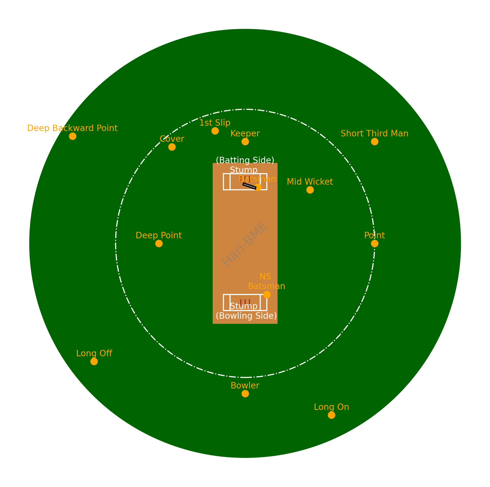

## Streamlit Cricket Pitch Visualization

This Streamlit app visualizes a cricket pitch, displaying fielder positions, stumps, and a bat using Matplotlib.

### Features
- **Fielder Positions:** Scatter plot of fielder positions on the cricket pitch, with labels indicating the position names.
- **Stumps:** Visualization of the batting and bowling stumps with labels.
- **Bat:** Representation of a cricket bat on the pitch.

### Installation
1. Clone this repository to your local machine using `git clone`.
2. Install the required Python packages using `pip install -r requirements.txt`.

### Usage
1. Run the Streamlit app using `streamlit run app.py`.
2. Open the provided local or network URL in your web browser to view the app.
3. Customize the code or app layout as needed for your specific use case.

### Contributing
Contributions are welcome! Feel free to open an issue or submit a pull request with any improvements or feature suggestions.

### License
This project is licensed under the MIT License - see the [LICENSE](LICENSE) file for details.

